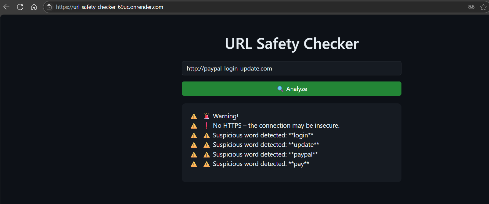

# url_safety_checker
Flask-based tool for analyzing URLs and detecting phishing indicators such as insecure protocols and suspicious keywords.

Demo verion: [https://url-safety-checker-69uc.onrender.com/]

How It Works: 
Users submit a URL.
The app checks if the link: uses HTTPS, contains suspicious keywords (like login, verify, update, etc.)
Displays a warning or approval message.

